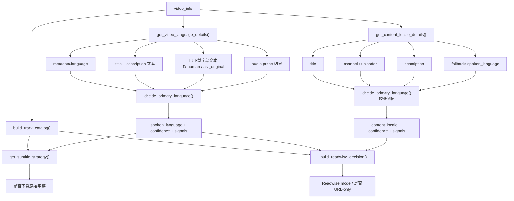
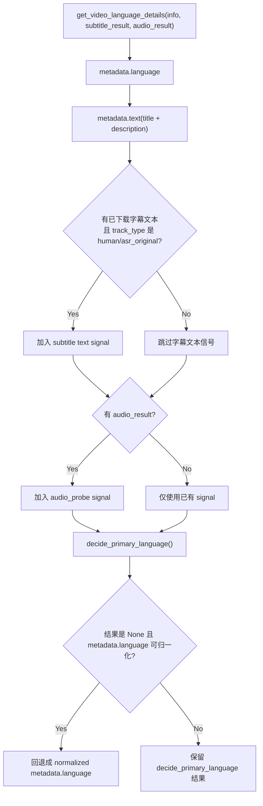
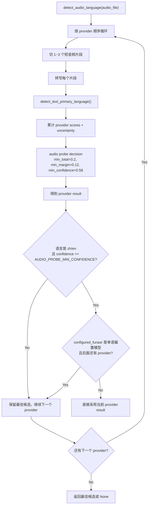

# 语言判定决策逻辑

本文档描述当前仓库里“视频主语言 / 内容语境 / 字幕与 Readwise 分支”这一整套判定链路，作为当前代码行为的说明文档。

当前实现主要分布在：

- `app/utils/language_detection.py`
- `app/services/video_service.py`
- `app/services/transcription_service.py`

## 1. 先区分 3 个概念

- `spoken_language`
  视频主体实际在说什么语言。代码里主要通过 `get_video_language_details()` 得出，最终字段名通常是 `language`。
- `content_locale`
  视频包装层面对准哪种读者/用户界面语言。代码里通过 `get_content_locale_details()` 得出。
- `track_catalog`
  平台可用字幕轨的分类结果。它用于决定“能不能下载原始字幕”和“是否直接 URL-only 剪藏”，但不会直接决定 `spoken_language`。

这 3 个概念故意分离。一个中文标题包装的英语视频，当前实现允许出现：

- `spoken_language = en`
- `content_locale = zh`

这正是 `spoken_language` 和 `content_locale` 分开的原因。

## 2. 总流程

## 3. 文本语言检测基础规则

`app/utils/language_detection.py` 提供两层基础能力：

- `detect_text_primary_language(text)`
- `decide_primary_language(scores, ...)`

### 3.1 `detect_text_primary_language()`

文本会先做清洗：

- 去掉 `WEBVTT`、`NOTE`
- 去掉时间戳、纯数字行
- 去掉 HTML 标签、常见字幕标记
- 保留中英文字符、英文单词、空格等

随后计算：

- 中文分数：`中文字符数 * 2`
- 英文分数：`英文字符数 + 英文单词数`

判定阈值：

- 总量 `< 12`：返回 `None`
- `zh_ratio >= 0.62` 且领先 `>= 0.18`：判 `zh`
- `en_ratio >= 0.62` 且领先 `>= 0.18`：判 `en`
- 中英文都 `>= 0.3`：判 `mixed`

### 3.2 `decide_primary_language()`

这是对多路 signal 累积分数后的总裁决，默认阈值为：

- `min_total = 0.25`
- `min_margin = 0.18`
- `min_confidence = 0.62`

规则：

- 总分不够：返回 `None`
- 两边分数都不低且差距太小：返回 `mixed`
- 否则如果领先方置信度和 margin 足够：返回领先语言
- 不满足时返回 `mixed`

## 4. `spoken_language` 当前怎么判

入口：`VideoService.get_video_language_details()`

### 4.1 当前信号源和权重

| 信号源 | 条件 | 最大权重 | 说明 |
| --- | --- | --- | --- |
| `metadata.language` | 归一化后是 `zh` / `en` | `0.55` | 显式平台元数据 |
| `metadata.language` | 非 `zh/en/mixed/unknown` 的其他语言 | 直接返回 | 直接返回该语言，置信度 `0.9` |
| `metadata.text` | `title + description[:600]` 可判定 | `0.22 * 文本置信度` | 元数据文本回退 |
| `subtitle.text.human` | 已下载字幕且轨道类型为 `human` | `0.82 * 文本置信度` | 只有真正下载后的字幕文本才参与 |
| `subtitle.text.asr_original` | 已下载字幕且轨道类型为 `asr_original` | `0.72 * 文本置信度` | 自动字幕原文 |
| `audio_probe` | 音频探测结果为 `zh/en` | `min(0.85, 0.55 + confidence * 0.3)` | 音频结果比 metadata 更强 |

当前实现里，**“平台上有哪些字幕轨”本身不作为 `spoken_language` 证据**。只有字幕内容被实际下载后，且它是原始语言轨（`human` / `asr_original`），字幕文本才会参与主语言判定。

### 4.2 决策图

## 5. 音频探测当前怎么判

入口：`TranscriptionService.detect_audio_language()`

默认 provider 顺序：

- `configured_funasr`
- `openai`

对应环境变量：

- `AUDIO_PROBE_PROVIDERS`
- `AUDIO_PROBE_MIN_CONFIDENCE`，默认 `0.58`

### 5.1 处理步骤

1. 读取音频时长。
2. 选取 1 到 3 个采样片段，默认锚点接近 `10% / 50% / 85%`。
3. 每段提取为 16kHz 单声道 WAV。
4. 用当前 provider 转写每段短音频。
5. 对每段转写文本调用 `detect_text_primary_language()`。
6. 将每段结果按“基线先验 + 重复覆盖”计入 `scores`：
   - `zh` 样本维持原权重。
   - `en` 样本先做一次折价，避免“视频里常见的英文片段”被当成过强证据。
   - 同一语言如果在多个采样段里重复出现，会获得一个覆盖补偿，表示它更像主体语言而不是插入语。
   - `mixed` 样本不会直接记到 `zh/en` 分数桶，而是记成一份 `uncertainty_mass`，专门压低最终置信度。
7. 对该 provider 的所有样本做一次带 `uncertainty_mass` 的总裁决，阈值仍是 `min_total=0.2`, `min_margin=0.12`, `min_confidence=0.58`。
8. 如果结果够可靠则提前采用；否则继续下一个 provider，并保留最佳候选。

### 5.2 一个关键保护

如果当前 provider 是 `configured_funasr`，且它暴露出的模型元数据显示这是一个**单语偏置模型**：

- 例如更偏 `zh`，且探测结果也正好是 `zh`
- 同时后面还有其他 provider 可继续验证

那么当前结果**不会立刻采用**，只会先保留为候选，继续跑后续 provider。这样可以降低“单语模型把所有音频都判成自己那种语言”的风险。

### 5.3 一个新的权重直觉

当前实现里，音频 probe 已经开始显式体现一个“近似贝叶斯”的直觉：

- 英语是常见插入语，所以单个英文样本默认折价。
- 中文样本不额外折价。
- 同一种语言如果在多个采样点持续出现，才逐步把权重补回来。
- `mixed` 样本不直接支持任一语言，而是增加“不确定性质量”。

这不是严格的贝叶斯模型，但它对应的产品语义是：

- “出现过英文”不等于“主体语言就是英文”
- “多个采样段都稳定是英文”才更接近“主体语言是英文”
- 置信度既受主导语言分数影响，也受混合样本带来的不确定性影响

### 5.4 决策图

## 6. `content_locale` 当前怎么判

入口：`VideoService.get_content_locale_details()`

它判断的不是“实际说什么语言”，而是“这个视频整体包装更像给哪种语言用户看的”。

### 6.1 信号源和权重上限

| 信号源 | 最大权重 | 说明 |
| --- | --- | --- |
| `content_locale.title` | `0.55 * 文本置信度` | 标题最强 |
| `content_locale.channel` | `0.32 * 文本置信度` | `channel + uploader` |
| `content_locale.description` | `0.18 * 文本置信度` | 简介只做弱信号 |
| `content_locale.fallback_spoken` | `min(0.2, 0.08 + spoken_confidence * 0.12)` | 当前面都没有证据时才回退 |

`content_locale` 使用的总裁决阈值更宽松：

- `min_total = 0.18`
- `min_margin = 0.12`
- `min_confidence = 0.58`

这意味着它更容易在弱包装信号下给出一个“面向中文还是面向英文”的结论。

## 7. 字幕下载当前怎么分支

入口：`VideoService.get_subtitle_strategy()`

### 7.1 轨道分类

`build_track_catalog()` 会把平台轨道分成：

- `human`
  来自 `subtitles`
- `translated`
  来自 `automatic_captions` 且 URL 里带 `tlang=...`
- `asr_original`
  来自 `automatic_captions`，但不是翻译轨

只有 `human` 和 `asr_original` 会被当作“原始语言候选轨”。

### 7.2 当前策略

1. 先看传入的 `language` 是否能归一化为 `zh/en`。
2. 如果不行，再用标题/简介文本做一次回退判定。
   - 这里要求更高：`_detect_metadata_text_language(min_confidence=0.8)`。
3. 如果还是不能确认 `zh/en`：
   - 不下载字幕
   - 直接走音频转录
4. 如果能确认：
   - `zh` 优先级：`["zh-CN", "zh", "zh-TW", "zh-Hans", "zh-Hant"]`
   - `en` 优先级：`["en", "en-US", "en-GB"]`
5. 只有在 `track_catalog` 里找到匹配主语言的原始字幕轨，才会尝试下载字幕。

结论：**不是“只要平台上有字幕就下载”，而是“主语言先确认，再去找匹配主语言的原始轨”**。

## 8. Readwise / URL-only 分支怎么使用这些结果

这里不是“语言判定本身”，但它直接消费上面的结果，所以也一起记录。

入口：

- `_build_readwise_decision()`
- `_should_clip_url_only()`

### 8.1 强开关

如果 `READWISE_URL_ONLY_WHEN_ZH_SUBS=true`，并且存在“原始中文字幕轨”：

- 直接判为 `url_only`
- `_should_clip_url_only()` 还会让流程在更早阶段直接跳过字幕下载和转录

### 8.2 其他 `url_only` 条件

即使没有强开关，只要：

- `content_locale == zh` 且 `spoken_language == en`
- 或 `content_locale == zh` 且 `spoken_language == mixed`
- 或 `content_locale == zh` 且 `spoken_confidence < 0.5`

当前实现也会倾向 `url_only`，原因分别是：

- `zh_locale_foreign_spoken`
- `zh_locale_mixed_spoken`
- `low_confidence_conflict`

### 8.3 Telegram 低置信度人工确认

对于 `request_source = telegram` 的任务，当前还加了一层“低置信度人工确认”：

- 如果 `spoken_language == mixed`
- 或 `spoken_confidence < 0.75`
- 或 `content_locale != spoken_language` 且 `spoken_confidence < 0.85`

后台任务会先进入 `waiting_for_language_confirmation`，由 Telegram bot 发一条带内联按钮的确认消息：

- `按中文处理`
- `按英文处理`
- `保持自动`

这条确认消息会显式带上对应视频的 URL，避免用户同时处理多条视频时混淆任务。

用户选择后，系统会覆盖本次任务的 `spoken_language`，并重新计算 `Readwise` 分支；如果超时未选，则回退到自动判断继续执行。

注意：这层人工确认发生在初次语言探测之后，因此它主要影响后续处理分支和 `Readwise` 决策，不会回溯重做前面已经完成的字幕下载策略。

## 9. 当前实现的几个边界

- 可用字幕轨语言本身不是 `spoken_language` 证据。
- 只有真正拿到字幕文本后，字幕文本才会反向增强主语言判定。
- `spoken_language` 和 `content_locale` 故意允许不同。
- `configured_funasr` 的单语偏置模型结果不会盲信。
- `mixed` 不是错误态，而是一个明确的中间结论，后续会影响字幕下载和 Readwise 分支。

## 10. 代码入口索引

- 文本清洗与基础判定：`app/utils/language_detection.py`
- 视频主语言：`app/services/video_service.py::get_video_language_details`
- 内容语境：`app/services/video_service.py::get_content_locale_details`
- 字幕策略：`app/services/video_service.py::get_subtitle_strategy`
- Readwise 分支：`app/services/video_service.py::_build_readwise_decision`
- 音频探测：`app/services/transcription_service.py::detect_audio_language`
